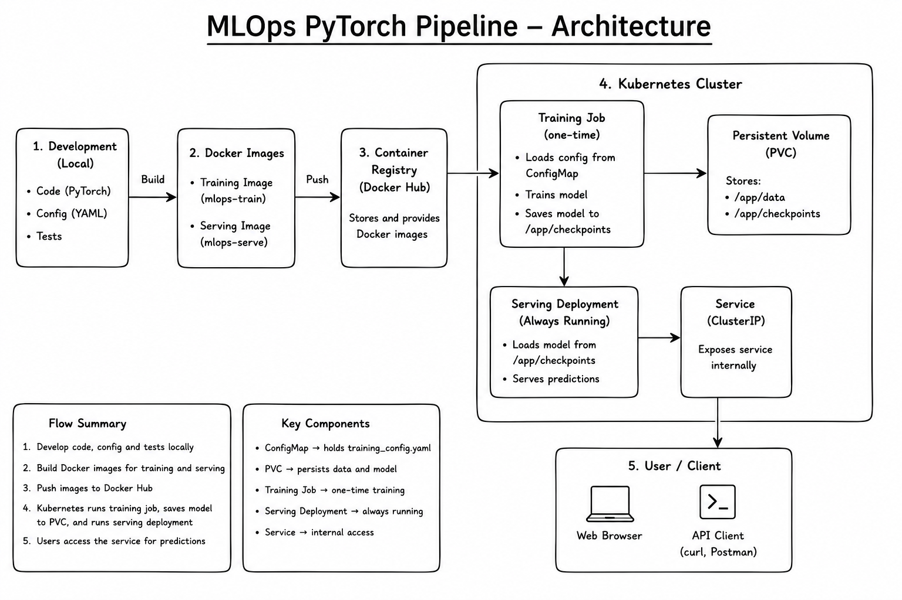

# MLOps PyTorch Pipeline

A simple end-to-end ML project for training and serving a CIFAR-10 image classifier with PyTorch, Docker, and Kubernetes.

## Architecture



## What this project does

- trains a PyTorch CNN model from a YAML config
- saves checkpoints for reuse
- serves predictions through a FastAPI app
- packages training and serving workloads in Docker
- deploys them in Kubernetes using a Job + Deployment
- runs CI checks with GitHub Actions

## Project structure

```text
mlops-pytorch-pipeline/
├── README.md
├── .gitignore
├── .github/workflows/ci.yml
├── src/
│   ├── model.py
│   ├── dataset.py
│   ├── train.py
│   └── serve.py
├── configs/training_config.yaml
├── docker/
│   ├── Dockerfile.train
│   └── Dockerfile.serve
├── k8s/
│   ├── namespace.yaml
│   ├── configmap.yaml
│   ├── training-job.yaml
│   ├── serving-deployment.yaml
│   ├── serving-service.yaml
│   ├── storage.yaml
│   └── hpa.yaml
├── requirements/
│   ├── train.txt
│   └── serve.txt
├── tests/test_model.py
├── checkpoints/
├── data/
└── pytest.ini
```

## Local setup

```bash
git clone <repo-url>
cd mlops-pytorch-pipeline
python -m venv .venv

# Windows PowerShell
.\.venv\Scripts\Activate.ps1

# Linux/macOS
source .venv/bin/activate
```

Install dependencies:

```bash
pip install -r requirements/train.txt
pip install -r requirements/serve.txt
pip install pytest
```

Run tests:

```bash
pytest -q
```

## Train locally

```bash
python src/train.py
```

Docker run:

```bash
docker build -f docker/Dockerfile.train -t mlops-train:v1 .
docker run --rm \
  -v $(pwd)/data:/app/data \
  -v $(pwd)/checkpoints:/app/checkpoints \
  mlops-train:v1
```

## Serve locally

```bash
docker build -f docker/Dockerfile.serve -t mlops-serve:v1 .
docker run --rm -p 8080:8080 \
  -v $(pwd)/checkpoints:/app/checkpoints \
  mlops-serve:v1
```

Check health:

```bash
curl http://localhost:8080/health
```

Predict:

```bash
curl -X POST http://localhost:8080/predict \
  -F "image=@test_image.png"
```

## Kubernetes

Apply manifests:

```bash
kubectl apply -f k8s/namespace.yaml
kubectl apply -f k8s/configmap.yaml
kubectl apply -f k8s/storage.yaml
kubectl apply -f k8s/training-job.yaml
kubectl apply -f k8s/serving-deployment.yaml
kubectl apply -f k8s/serving-service.yaml
kubectl apply -f k8s/hpa.yaml
```

Verify:

```bash
kubectl get pods -n ml-training
kubectl describe deployment model-serving -n ml-training
```

## Git workflow

Use feature branches such as:

- `feature/docker-training`
- `feature/k8s-deployment`

Merge through pull requests with meaningful commit messages like:

- `feat: add training pipeline`
- `fix: correct serving checkpoint path`
- `ci: add test workflow`

## Notes

This project is designed for local validation and Minikube-style Kubernetes deployment workflows.
